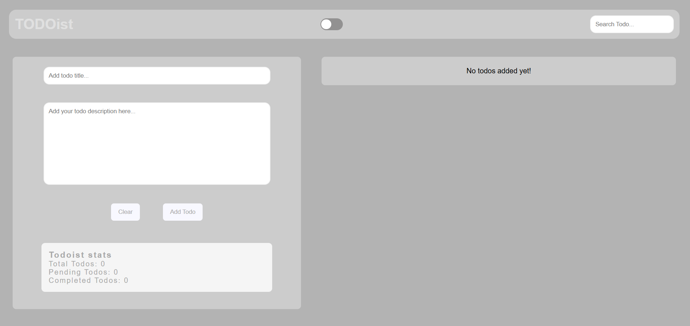

# Todoist - Task Management Application



## Overview

Todoist is a simple yet powerful task management application that helps you organize your todos efficiently. With features like dark mode, search functionality, and task statistics, it provides a clean interface for managing your daily tasks.

## ✨ Features

- ✅ Add todos with titles and descriptions
- ✔️ Mark todos as completed
- 🗑️ Delete todos
- 🔍 Search functionality to filter todos
- 🌙 Dark/Light mode toggle
- 📊 Real-time statistics (Total, Pending, Completed todos)
- 💬 Toast notifications for user feedback

## 🛠️ Technologies Used

### Frontend
- HTML5
- CSS3
- JavaScript (ES6)

### Libraries
- [Toastify-js](https://github.com/apvarun/toastify-js) - For beautiful toast notifications
- [Google Fonts (Montserrat)](https://fonts.google.com/specimen/Montserrat) - For typography

## 🚀 Installation and Setup

### Option 1: Using the files directly
1. Download the project files (`index.html`, `style.css`, `script.js`)
2. Open `index.html` in your browser

### Option 2: Cloning the repository
```bash
git clone https://github.com/your-username/todoist.git
cd todoist
open index.html
use live server to run
```